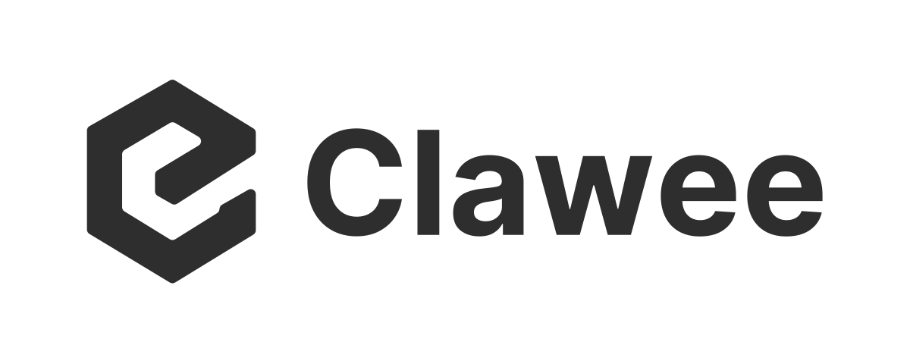

<div align="center">

<picture>
  <source media="(prefers-color-scheme: dark)" srcset="./client/resources/logo-v2-white.svg" />
  
</picture>

<h1>可自托管的企业级 Agent</h1>

<p>让 Agent 本地执行、企业能力接入与统一治理在一个平台中协同运行。</p>

[](https://github.com/krillinai/Clawee/stargazers)
[](https://www.apache.org/licenses/LICENSE-2.0)
[](https://github.com/krillinai/Clawee/releases)

[项目特色](#项目特色) · [核心工作流](#核心工作流) · [系统架构](#系统架构) · [快速开始](#快速开始) · [桌面与-web](#桌面与-web) · [配置与安全](#配置与安全) · [开发与验证](#开发与验证) · [文档](#文档)

</div>

## 项目介绍

Clawee 是面向企业部署与治理的开源 Agent 平台。它将本地 Agent 执行能力与企业级治理能力组合在一起，让组织既能在企业受控环境中完成模型配置、任务执行和文件操作，也能通过自托管 Gateway 统一管理账号、Agent 身份、MCP 能力、权限、审计与共享资源。

Clawee 由两个边界清晰、彼此协作的部分组成：

- **本地执行层**：共享 Web、本地 daemon、Electron 桌面端与内嵌 Codex Runtime，负责任务、会话、工作区文件、模型、Skill、定时任务和系统原生能力。
- **企业治理层**：Go Gateway 与管理台，负责账号与会话、Agent 身份、RBAC、MCP 上游与能力目录、授权门禁、审计、Collector、Skill Hub、知识库和共享文件。

桌面端和浏览器端使用同一套任务界面。桌面端额外提供内嵌 Runtime、文件系统、通知和更新等原生能力。Gateway 既服务 Clawee 客户端，也可作为其他 MCP Client 或 Agent Runtime 接入企业能力的统一入口。

Clawee 采用 Apache-2.0，通用能力全部开放。模型托管、计费、钉钉、百炼及其他外部服务都按需配置；未配置时不影响本地工作台与 Gateway 的核心能力。项目默认使用自带的模型服务接入方式，不依赖维护者运营的公共模型网关，也不替代企业已有的 OA、ERP、CRM 等业务系统。

> 当前优先开放客户端与服务端源码，首个整合版本目标为 **0.1.0**。整合阶段保留现有依赖，第三方再分发许可补齐或替换另作专项处理，进度见 [第三方组件说明](third_party/README.md)。正式安装包与镜像尚在准备中，请以 [GitHub Releases](https://github.com/krillinai/Clawee/releases) 的实际发布内容为准。

## 项目特色

- **本地优先的 Agent 执行**：任务、Runtime 会话、工作区文件和模型凭据默认保存在用户设备，并通过本地 daemon 调用内嵌 Codex Runtime。

- **桌面与 Web 共用体验**：通用任务、会话和设置只实现一次；Electron 仅补充目录选择、窗口、通知、更新等操作系统能力。

- **完整的任务工作台**：统一管理模型、任务、会话、文件、Skill、定时任务、审批与运行状态。

- **企业级 MCP 治理**：通过 Gateway 统一管理 MCP 上游、能力目录、Agent 身份、账号授权、调用门禁与审计记录。

- **团队资源共享**：集中管理 Skill Hub、知识库、共享文件与 Collector，在明确授权后向 Agent 提供能力。

- **可自托管、可选集成**：核心服务由部署者自行运行；钉钉、百炼和其他外部服务仅在显式配置后启用。

## 核心工作流

### 本地 Agent 任务

1. 用户在桌面端或浏览器端创建任务。
2. 共享 Web 通过本地 API 与 daemon 通信。
3. daemon 管理模型配置、会话、工作区文件与 Codex Runtime。
4. Runtime 根据用户授权调用模型、文件、命令、Skill 或 MCP 能力。

### 企业能力接入

1. 部署者在管理台配置 MCP 上游并同步能力目录。
2. 管理员按账号或 Agent 身份授予能力，并配置确认或审批门禁。
3. Agent 通过 Gateway 调用已授权能力。
4. Gateway 转发请求，并记录调用身份、能力与结果审计。

### 桌面与浏览器协同

桌面端和浏览器端共享同一套 Web 实现，但本地任务历史和 Runtime 数据默认保存在各自设备，不会自动跨设备同步。企业账号、授权、审计和共享资源由自托管 Gateway 管理。

## 系统架构

```text
+---------------------------+       +---------------------------+
| 浏览器                    |       | Electron 桌面端           |
| 共享 Web 开发入口         |       | 共享 Web + 原生能力       |
+-------------+-------------+       +-------------+-------------+
              |                                   |
              +-----------------+-----------------+
                                v
+----------------------------------------------------------------+
| 共享任务界面 / client/apps/web                                 |
| 任务、会话、模型、文件、Skill、定时任务、企业能力入口          |
+-------------------------------+--------------------------------+
                                |
                 +--------------+--------------+
                 | 本地 API / SSE              | HTTPS
                 v                             v
+--------------------------------+  +-----------------------------+
| 本地 daemon                    |  | 自托管 Gateway              |
| 任务、会话、模型、文件、SQLite |  | 账号、RBAC、MCP、审计       |
| Codex Runtime 与系统能力       |  | Skill、知识库、共享文件     |
+---------------+----------------+  +---------------+-------------+
                |                                   |
                v                                   v
+--------------------------------+  +-----------------------------+
| 用户选择的模型服务             |  | PostgreSQL / MCP 上游       |
| 本地工作区与系统工具           |  | 可选企业系统与外部集成      |
+--------------------------------+  +-----------------------------+
```

| 组件 | 职责 | 主要实现 |
| --- | --- | --- |
| 共享 Web | 桌面与浏览器共用的任务界面 | React 18、Vite、TypeScript |
| 本地 daemon | 任务、模型、会话、文件、Skill、定时任务与本地数据 | Node.js、Fastify、SQLite |
| Desktop | 内嵌 Web、daemon 和 Codex Runtime，提供系统原生能力 | Electron |
| Gateway | 账号、Agent 身份、MCP 治理、审计与企业资源 | Go、Gin、PostgreSQL |
| 管理台 | Gateway 的管理与用户端界面 | React 19、Vite、Tailwind CSS |

更完整的数据流向与信任边界见 [架构与数据边界](docs/architecture.md)。

## 快速开始

### 环境要求

- Node.js 24
- Corepack
- pnpm 10.33.3，由仓库的 `packageManager` 字段锁定
- Go 1.25 或更新兼容版本
- Docker 与 Docker Compose
- 当前平台构建原生 Node 模块所需的工具

Windows 下的服务端 Bash、Make 与源码脚本请在 WSL2 中执行。macOS 桌面开发需要图形登录会话。

先检查本地环境：

```bash
node --version
corepack --version
go version
docker compose version
```

### 启动 Gateway

在终端执行：

```bash
git clone https://github.com/krillinai/Clawee.git
cd Clawee

corepack enable pnpm
pnpm run setup

export CLAWEE_OPS_DIR="$HOME/clawee-ops"
pnpm run init --ops-dir "$CLAWEE_OPS_DIR"

docker compose -f server/deploy/docker-compose.yaml up -d --wait
pnpm run db:migrate
pnpm run server:dev
```

初始化命令会在源码仓库外生成随机密钥和权限为 `0600` 的配置文件；重复运行不会覆盖已有配置。根目录脚本统一使用 `pnpm run <脚本名>`，其中 `setup` 和 `init` 必须保留 `run`，避免执行 pnpm 自带的同名命令。

Gateway 与内嵌管理台可通过 `http://127.0.0.1:1904` 访问。首次部署应先通过防火墙或访问控制限制到部署者，由部署者完成首个账号注册；首个账号会获得管理员权限。完成初始化后，再通过 HTTPS 反向代理开放服务。普通用户的注册、权限和 MCP 上游由部署者管理。

### 启动桌面端

另开一个终端，在仓库根目录运行：

```bash
pnpm run client:dev
```

在登录页面设置自己的 Gateway 地址。登录后填写模型服务地址、模型名和 API Key，即可创建任务。真实模型任务需要自行提供有效模型服务；单元测试和受控 Runtime 测试使用模拟服务，无需维护者账号。MCP 调用还需由部署者在管理台配置上游服务并给账号授权。

远程 Gateway 必须使用 HTTPS，本机开发可以使用 HTTP。切换 Gateway 前需要退出登录并结束正在运行的任务，登录凭据按 Gateway 地址隔离。

## 桌面与 Web

桌面端和浏览器端使用 `client/apps/web` 中的同一套 React 前端。桌面端负责启动并嵌入 daemon、Web 和 Codex Runtime；浏览器开发入口会按需启动本机 daemon，并通过代理访问。

| 场景 | 命令 | 默认访问地址 |
| --- | --- | --- |
| Electron 桌面开发 | `pnpm run client:dev` | 桌面窗口 |
| 客户端 Web 开发 | `pnpm run web:dev` | `http://127.0.0.1:19860` |
| Gateway 后端 | `pnpm run server:dev` | `http://127.0.0.1:1904` |
| 管理台开发 | `pnpm run admin:dev` | `http://127.0.0.1:5904` |

浏览器端与桌面端的本地数据目录彼此独立。原生文件选择、托盘、通知和更新等能力仅在桌面端提供；本地 daemon 始终只应监听回环地址。

## 配置与安全

### 默认端口

| 服务 | 监听地址 | 说明 |
| --- | --- | --- |
| PostgreSQL 开发数据库 | `127.0.0.1:15932` | 使用本机 trust 认证，仅用于开发 |
| Gateway 与内嵌管理台 | `0.0.0.0:1904` | 本机访问使用 `http://127.0.0.1:1904` |
| 管理台开发服务器 | `0.0.0.0:5904` | 本机访问使用 `http://127.0.0.1:5904` |
| 客户端 Web 开发服务器 | `0.0.0.0:19860` | 本机访问使用 `http://127.0.0.1:19860` |

`0.0.0.0` 是监听地址，不是客户端连接地址。其他设备访问时应使用部署机器的实际 IP 或域名，并只在受信开发网络中开放开发服务器。

### 运维配置

真实配置必须保存在仓库外，通过 `CLAWEE_OPS_DIR` 指定：

```bash
export CLAWEE_OPS_DIR="$HOME/clawee-ops"
pnpm run init --ops-dir "$CLAWEE_OPS_DIR"
```

已有运维配置保持不变。如需明确覆盖 Gateway 监听地址，启动前设置 `CLAW_MCP_SERVER_ADDR=0.0.0.0:1904`：

```bash
export CLAW_MCP_SERVER_ADDR="0.0.0.0:1904"
```

也可以在外部配置中将 `server.addr` 设置为相同值。完整配置来源、环境变量映射和 Secret 要求见 [配置参考](server/docs/getting-started/configuration.md)。

### 数据边界

- 本地任务、Runtime 会话、工作区文件和模型凭据默认保存在用户设备。
- 模型执行时，必要内容会发送给用户选择的模型服务。
- 账号、认证会话、授权、审计及共享资源由自托管 Gateway 管理。
- MCP 请求由 Gateway 按账号与 Agent 权限转发至部署者配置的上游，并记录审计。
- Agent 活动默认关闭直报；仅在显式启用后发送给配置的 Gateway。
- 删除本地任务不会同步删除外部模型服务数据或 Gateway 审计记录。

不要将真实密钥、运维配置、聊天记录、客户材料、数据库、截图 trace 或测试报告提交到仓库。第三方 Skill 与 MCP 工具可能执行代码或访问外部网络，安装和授权前应审查来源与权限。

## 项目结构

| 目录 | 职责 |
| --- | --- |
| `client/apps/web` | 桌面与浏览器共用任务界面 |
| `client/apps/daemon` | 本地任务、模型、文件、Skill 与会话执行 |
| `client/apps/desktop` | Electron 外壳、内嵌 Runtime、原生能力与更新 |
| `client/packages` | 客户端共享协议与 Skill 市场能力 |
| `server` | Go Gateway、MCP 权限审计、Collector、Skill Hub、知识库与共享文件 |
| `server/web` | Gateway 管理台与用户端管理界面 |
| `server/db` | 数据库迁移与种子数据 |
| `scripts` | 整合项目的安装、初始化、构建、测试与验收入口 |
| `docs`、`server/docs` | 整合项目文档与 Gateway 专项文档 |
| `third_party` | 第三方许可、声明和再分发材料 |

客户端与 `server/web` 使用独立依赖工作区和锁文件。修改依赖时只更新所属工作区，不要跨目录重建锁文件。

## 开发与验证

### 常用命令

| 命令 | 用途 |
| --- | --- |
| `pnpm run test` | 初始化与根脚本测试 |
| `pnpm run client:test` | 客户端测试 |
| `pnpm run server:test` | 服务端测试 |
| `pnpm run client:build` | 客户端全量构建 |
| `pnpm run server:build` | 服务端与 Collector 构建 |
| `pnpm run desktop:preflight:local` | 提交前完整桌面预检 |
| `pnpm run desktop:preflight:release` | 正式桌面发布预检 |
| `pnpm run desktop:tag:check` | 正式发布 Tag 检查 |

服务端 PostgreSQL 集成测试必须使用独立、名称以 `_test` 结尾的数据库，并设置 `CLAW_MCP_TEST_DATABASE_URL`。测试会修改数据，不能指向日常开发或生产数据库。

### 容器端到端验收

端到端验收使用全新的容器、数据库卷和随机端口，并在结束后自动清理：

```bash
docker build -f server/Dockerfile -t clawee-server:oss-local .
node scripts/container-smoke.mjs
```

该验收覆盖数据库初始化、登录、MCP 未授权拒绝、授权调用、撤销和重启持久化。

真实模型验收还需要先通过桌面本地预检，再将包含 `base_url`、`model`、`api_key` 的 JSON 配置放在仓库外，以 `0600` 权限保存，并运行：

```bash
CLAWEE_EXTERNAL_MODEL_CONFIG="$HOME/clawee-test-model.json" node scripts/container-smoke.mjs
```

真实模型验收会向所配置的模型服务发出请求，并使用隔离的打包 App，关闭截图、视频与 trace。模型配置文件及测试报告不得提交。

## 文档

- [功能验证与操作指南](docs/validation-and-operations.md)：启动、功能验收与部署步骤
- [正式发布前待处理事项](docs/pre-release-checklist.md)：CI、仓库设置、签名与正式发行
- [架构与数据边界](docs/architecture.md)：本地执行层与企业治理层的数据边界
- [服务端开发](server/docs/getting-started/development.md)：Gateway 本地开发流程
- [配置参考](server/docs/getting-started/configuration.md)：配置来源、覆盖规则与 Secret 管理
- [生产部署与备份](server/docs/deployment/production.md)：迁移、反向代理、持久化、备份与恢复
- [MCP 上游集成](server/docs/integration/upstream-mcp.md)：接入企业 MCP Server
- [贡献约定](CONTRIBUTING.md)：开发与提交要求
- [安全报告](SECURITY.md)：私密报告安全问题

## 参与贡献

欢迎提交 Issue 与 Pull Request。请保持改动边界清晰，并在 PR 中说明解决的问题、用户可见变化、验证结果与尚未覆盖的环境。推荐使用 `git commit -s` 添加 DCO 签署。

桌面与浏览器的通用界面只在共享 Web 中实现一次。客户端可执行代码、依赖、构建或发布配置发生变化时，提交前需要运行 `pnpm run desktop:preflight:local`。

## 许可证

Clawee 采用 [Apache License 2.0](LICENSE)。归属说明见 [NOTICE](NOTICE)，第三方依赖与内嵌工具保留各自许可。

桌面正式更新来自本仓库 GitHub Releases 的 stable 渠道，社区开发构建默认不启用上游自动更新。服务端与桌面端按同一版本组合交付，旧私有仓库的历史不会导入这里。
