# Clawee 功能使用指南

> 适用对象：第一次使用 Clawee 的普通成员，以及负责企业资源和权限配置的管理员。
>
> 界面基准：2026 年 9 月 10 日。实际菜单会随账号权限、部署方式和已配置能力略有不同。

这是一份面向普通用户的功能使用指南，按三个实际入口分别组织。使用 Clawee 桌面 App 完成任务，请阅读第 1、2 章；负责 Gateway 账号或设备接入，请阅读第 1、3 章；系统管理员请阅读第 1、4 章。常见问题和安全要求见第 5、6 章。

文中截图来自功能验证环境，指标、资源名称和按钮可用状态以客户自己的部署为准。

## 目录

- [1. 先认识 Clawee](#1-先认识-clawee)
- [2. Clawee 桌面 App：普通成员工作台](#2-clawee-桌面-app普通成员工作台)
- [3. Gateway 用户中心：账号与企业资源](#3-gateway-用户中心账号与企业资源)
- [4. Gateway 管理后台：企业治理](#4-gateway-管理后台企业治理)
- [5. 常见问题](#5-常见问题)
- [6. 安全使用要点](#6-安全使用要点)

## 1. 先认识 Clawee

### 1.1 Clawee 能帮你做什么

Clawee 是一个 Agent 工作台。你可以用自然语言描述目标，让 Agent 在指定项目中读取资料、修改文件、执行命令，并调用经过授权的企业能力。

常见用法如下：

| 我想做什么 | 使用哪个功能 | 从哪里进入 |
| --- | --- | --- |
| 让 Agent 完成一次写作、分析或开发任务 | 会话 | 侧栏“新建会话” |
| 让 Agent 读取或修改本机文件 | 项目、文件工作区 | 侧栏“项目”，会话顶部“文件” |
| 找回正在运行、等待确认或失败的任务 | 最近会话、系统通知 | 侧栏“最近会话”或点击系统通知 |
| 定时生成报告、提醒或执行重复工作 | 定时任务 | 侧栏“定时任务” |
| 使用组织提供的标准流程 | 企业 Skill | 侧栏“企业Skill中心” |
| 调用外部服务或企业系统 | 连接器 | 侧栏“连接器” |
| 查询制度、产品资料和内部文档 | 企业知识库 | 侧栏“企业知识库” |
| 获取或共享团队文件 | 共享网盘 | 侧栏“共享网盘” |
| 查看 Agent 活动和业务指标 | Agent动态、数据看板 | 侧栏对应入口 |
| 查看账号、设备接入和企业工具授权 | Gateway 用户中心 | 浏览器访问 Gateway |

### 1.2 小白只需要先认识这几个词

| 界面用词 | 可以怎样理解 |
| --- | --- |
| Agent | 帮你执行任务的智能助手。你说目标，它可以阅读资料、生成内容、修改文件或调用获准工具 |
| 项目 | Agent 本次可以处理的本机文件夹，例如“客户反馈”或“产品资料”文件夹 |
| 会话 | 你和 Agent 完成一项任务的完整工作记录，包括要求、回复、操作过程和结果 |
| 模型 | Agent 用来理解和生成内容的人工智能服务。不确定选哪个时使用组织默认值 |
| Skill | 组织准备好的标准做事方法，例如“按统一模板生成周报” |
| 连接器 | 让 Agent 使用其他系统或企业工具的通道，例如查询知识库或业务数据 |
| Gateway | 管理企业账号、权限和共享资源的网站。普通任务主要在 Clawee App 中完成 |

文档中偶尔出现的 Runtime、MCP、Collector、Token 属于运行或接入概念。普通用户不需要先学会这些词；遇到相关报错时按本文排查，仍无法解决就联系管理员。

### 1.3 按入口选择正确章节

| 入口 | 谁使用 | 主要用途 |
| --- | --- | --- |
| Clawee 桌面 App | 普通成员 | 执行任务、处理本机文件、使用 Skill 和连接器 |
| Gateway 用户中心 | 账号或设备负责人 | 查看 Agent 接入、企业工具授权、设备状态和共享资源 |
| Gateway 管理后台 | 管理员 | 管理账号、企业资源、Agent 接入、MCP 网关和审计 |

三个入口的界面和权限不同。看到相似功能名称时，先确认自己当前使用的是桌面 App、Gateway 用户中心还是 Gateway 管理后台，不要照着另一个入口的截图寻找按钮。

本地任务、会话、工作区文件和模型凭据默认保存在用户设备；企业账号、授权、审计和共享资源由自托管 Gateway 管理。删除本地会话不会自动删除 Gateway 审计或外部服务中的数据。

### 1.4 使用桌面 App 的最短路径

第一次使用时，先完成这一条路径即可：

1. 登录 Clawee。
2. 添加一个项目目录。
3. 点击“新建会话”。
4. 保留默认模型和“请求批准”权限。
5. 添加需要处理的文件，写清任务目标并发送。
6. 需要时检查并批准操作，任务完成后打开实际结果。

后续章节会逐步解释每一步。

## 2. Clawee 桌面 App：普通成员工作台

> 本章所有操作和截图均来自 Clawee 桌面 App。

### 2.1 10 分钟完成第一个任务

下面用同一个例子走完整流程：让 Agent 读取 `feedback.md`，生成一份客户反馈分类报告。没有这个文件时，可以换成任意允许处理的 Markdown 或纯文本文档，并在任务要求中改成实际文件名。

#### 2.1.1 登录企业账户

1. 打开 Clawee 桌面 App。
2. 如果出现 Gateway 地址设置，填写组织提供的 HTTPS 地址。
3. 在登录页输入管理员分配的企业账号和密码。
4. 阅读并确认页面展示的协议后，点击“登录”。
5. 登录成功后，检查侧栏底部显示的账号和组织是否正确。

**完成标志：** 登录页消失，页面左侧出现项目、会话等工作台入口。

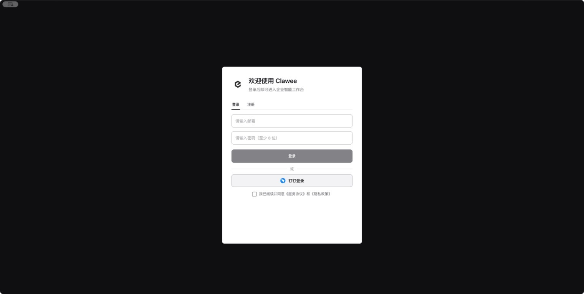

这里登录的是 Clawee 桌面 App。浏览器中的 Gateway 用户中心和管理后台从第 3、4 章进入，不要混用界面步骤。

登录页按钮说明：

| 按钮 | 什么时候使用 |
| --- | --- |
| 登录 | 已有企业账号时使用 |
| 注册 | 组织允许自行注册时使用；大多数企业由管理员统一创建账号 |
| 钉钉登录 | 组织已启用钉钉身份集成时使用 |

#### 2.1.2 添加存放资料的项目

项目决定 Agent 能看到和操作的主要文件目录。处理不同客户、业务或代码仓库时，应分别创建项目。

新项目有两种创建方式：

- 本机还没有目录：点击“添加项目” -> “新建项目”，填写名称并选择保存位置。
- 已有资料或代码目录：点击“添加项目” -> “使用现有文件夹”，选择本机目录。

本例选择存放 `feedback.md` 的文件夹。添加完成后，项目会出现在侧栏。点击项目名称可展开其中的会话。

**完成标志：** 左侧项目列表出现刚添加的文件夹名称；点击后可以看到“在项目中新建会话”等操作。

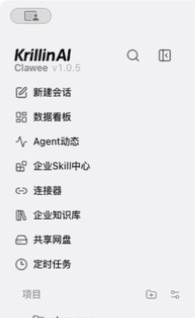

左侧上方是日常功能入口；“项目”标题右侧的文件夹加号用于添加项目，调节图标用于管理项目。截图在项目名称出现前截断，未展示本机项目和历史会话。

项目相关按钮：

| 按钮 | 功能 |
| --- | --- |
| 添加项目 | 打开“新建项目”和“使用现有文件夹”选项 |
| 管理项目 | 查看项目目录并维护项目设置 |
| 在项目中新建会话 | 直接以该项目为工作目录创建会话 |
| 更换目录 | 让项目改为指向另一个本机目录 |
| 移除项目 | 只从 Clawee 项目列表移除，不删除本机文件 |
| 拖动项目 | 调整项目在侧栏中的顺序 |

#### 2.1.3 在项目中新建会话并确认可以运行

1. 在左侧找到刚添加的项目。
2. 点击项目行右侧的铅笔图标“新建会话”；也可以点击页面顶部“新建会话”，再从项目选择器中选择该项目。
3. 观察页面底部的输入框和模型位置。输入框可用且已有模型名称时，保留组织默认模型。
4. 如果显示“模型不可用”、没有可选模型或本地运行服务未连接，先重启 Clawee，再进入“设置” -> “诊断”执行检查；仍不可用时把错误提示发给管理员。
5. 点击权限选项，选择“请求批准”。

**完成标志：** 新会话已经打开，项目名与刚添加的文件夹一致，输入框可用，并且能看到一个已选择的模型。

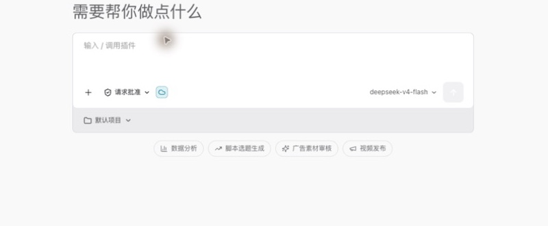

图中从左到右可完成添加上下文、选择权限、查看已启用连接器、选择模型和发送任务；输入区下方用于确认当前项目。图中已经选择“请求批准”。截图只保留桌面 App 的任务输入区域，未展示本机项目和历史会话。

#### 2.1.4 添加文件并发送任务

即使文件已经放在项目中，也建议第一次操作时明确附加它，避免 Agent 找错文件。

1. 点击输入区的“添加上下文” -> “添加文件”。
2. 选择 `feedback.md`，等待文件名出现在输入框附近。
3. 输入下面的任务要求。
4. 检查项目名、附件名和任务范围，然后点击“发送”。

```text
请读取 feedback.md，整理客户反馈并在 reports 目录新建 feedback-report.md。
报告包含：问题分类、各类数量、典型反馈和建议优先级。
不要修改原始文档，不要向外部系统发送客户联系方式。
完成后告诉我新建了哪个文件，以及你怎样检查结果。
```

**完成标志：** 会话时间线出现你刚发送的要求，随后开始显示 Agent 的回复或操作过程。

#### 2.1.5 处理任务中的确认请求

当任务需要写入报告文件或执行其他受保护操作时，当前会话会出现审批卡片：

1. 查看准备执行的动作。
2. 核对文件路径是否位于当前项目，目标文件是否是 `reports/feedback-report.md`。
3. 内容和范围都正确时点击“批准”；不确定时点击“拒绝”，并告诉 Agent 需要怎样调整。
4. 如果离开了当前会话，在左侧“最近会话”中找到刚才的任务并点击；收到“任务等待审批”系统通知时，也可以点击通知直接返回对应会话。

**完成标志：** 批准后任务继续运行；拒绝后任务停止该动作并等待新的要求。

#### 2.1.6 打开并验收结果

1. Agent 回复完成后，先看回复中是否说明新建的文件和验证结果。
2. 点击会话顶部“文件”，展开 `reports` 目录。
3. 点击 `feedback-report.md` -> “预览”。
4. 检查报告是否包含任务要求的四项内容，并确认 `feedback.md` 没有被修改。
5. 需要调整时回到会话，直接说出缺少的内容，例如“请补充每类问题的占比，仍然不要修改原始文档”。

**完成标志：** `reports/feedback-report.md` 确实存在于本机项目中，内容可打开，并满足任务要求。只有看到真实文件，才算完成了本例任务。

### 2.2 日常完成任务：会话功能详解

完成上面的第 2.1 节示例后，就可以把同样的方法用于写作、分析、整理资料、处理代码等任务。本节解释怎样把任务说清楚，以及运行过程中各项功能怎样使用。

#### 2.2.1 新建会话并选择运行方式

1. 点击侧栏“新建会话”。
2. 点击输入区上方的项目名称，选择任务所属项目。
3. 点击模型名称，选择模型和推理级别。不确定时保留组织默认值。
4. 点击权限按钮，普通任务选择“请求批准”。
5. 在输入框中写清任务要求，点击“发送”。

新会话适合开始一项新任务。继续修改同一份结果时，直接在原会话补充要求，Agent 才能看到前文和已经完成的操作。

建议按下面的结构描述任务：

```text
目标：需要完成什么。
背景：已有资料、当前问题或使用场景。
范围：允许处理哪些文件或内容。
限制：哪些内容不能修改，是否允许新增依赖或访问外部服务。
验收：最终要交付什么，如何判断完成。
```

例如：

```text
目标：整理本周客户反馈，输出一份问题分类报告。
背景：反馈记录保存在当前项目的 feedback.md。
范围：只读取该文档，在 reports 目录新建 Markdown 报告。
限制：不要修改原始文档，不向外部服务上传客户联系方式。
验收：报告需要包含问题分类、数量、典型反馈和建议优先级。
```

#### 2.2.2 理解权限选项

| 权限 | 适用场景 | 会发生什么 |
| --- | --- | --- |
| 请求批准 | 日常使用，推荐作为默认值 | Agent 遇到需要确认的文件或命令操作时暂停并询问你 |
| 完全访问权限 | 范围明确、来源可信且确实需要连续执行的任务 | Agent 可访问本机文件并执行本地操作，风险更高 |

选择“完全访问权限”后还会出现“开启完全访问权限”确认按钮。确认前重新检查项目目录、附件和任务范围。完全访问并不代表 Agent 的操作会自动回滚。

#### 2.2.3 给任务补充文件、Skill 或连接器

点击输入区的“添加上下文”，可以给当前消息补充更多信息或能力：

- 选择“添加文件”：附加本机文档、代码、表格或图片。
- 选择“技能”：使用已经安装的 Skill。
- 选择“连接器”：开启当前任务需要的 MCP 工具。

发送前检查附件名称和项目是否正确。含客户信息、密码、Token 或内部资料的附件，必须先确认允许发送到当前模型服务。

**完成标志：** 文件名、Skill 名称或连接器名称显示在输入区附近，并且发送后 Agent 明确识别到了它。若 Agent 提示找不到文件，先检查项目是否正确、附件是否上传完成，再重新附加。

相关按钮：

| 按钮 | 功能 |
| --- | --- |
| 添加上下文 | 打开文件、Skill 和连接器入口 |
| 添加文件 | 选择本机文件并附加到当前消息 |
| 技能 | 选择本次任务使用的 Skill |
| 管理技能 | 进入完整的 Skill 安装和管理页面 |
| 连接器 | 选择本次任务使用的连接器 |
| 连接器快捷开关 | 临时启用或停用某个连接器 |
| 选择更多连接器 | 打开完整连接器列表 |
| 移除附件 | 只从当前消息移除，不删除本机文件 |
| 重试上传 | 对上传失败的附件重新尝试 |

#### 2.2.4 任务运行时怎么操作

发送后，时间线会展示 Agent 回复、工具调用、文件修改和审批请求。运行过程中可以继续补充要求。

| 我想做什么 | 使用方法 |
| --- | --- |
| 补充后续要求 | 点击“发送方式”并选择“排队发送”，消息会在当前步骤后处理 |
| 让某条等待消息先处理 | 点击该消息上的“优先执行等待任务” |
| 撤回还没执行的等待消息 | 点击“移除等待任务” |
| 立即停止当前运行 | 点击“停止任务” |

停止任务只会停止后续执行。已经写入的文件、执行的命令或发出的外部请求不会自动撤销。

会话时间线长时间没有变化时，先等待当前工具调用结束，再从左侧“最近会话”重新打开任务。显示“失败”时查看错误详情，根据提示修正模型、项目、权限或连接器后再重试。

#### 2.2.5 处理审批请求

审批通常直接出现在当前会话中；离开会话后，可以从左侧“最近会话”找到原任务，或点击“任务等待审批”系统通知返回。当任务暂停并显示待审批操作时：

1. 阅读 Agent 准备执行的具体动作。
2. 检查命令或动作名称、文件路径、目标服务和准备发送的数据。
3. 确认与任务目标一致后点击“批准”。
4. 如果范围不正确或风险不清楚，点击“拒绝”，并在会话中说明如何调整。

不要仅根据按钮颜色快速批准。网页、第三方 Skill 和 MCP 工具返回的文字也可能包含不适合执行的指令。

#### 2.2.6 判断任务是否真的完成

不要只看 Agent 是否说了“已完成”，要按结果类型检查：

| 结果类型 | 怎样验收 | 完成标志 |
| --- | --- | --- |
| 纯文字结果 | 检查回复是否回答了问题、引用了正确资料、没有遗漏要求 | 回复内容可以直接使用，关键事实已人工核对 |
| 本地文件结果 | 点击“文件”打开真实文件，检查名称、位置、内容和原文件是否被误改 | 文件确实保存在项目目录，并能正常打开 |
| 外部系统调用结果 | 到目标系统查看新增或更新记录；有权限时再核对 Gateway 审计 | 目标系统中出现预期结果，调用对象和数据正确 |

重要任务还应要求 Agent 运行测试、给出验证结果，或由人工抽查产物。发现结果不完整时，在原会话中指出具体缺口；不要为了小修改重新开始一个没有上下文的新会话。

### 2.3 管理项目、会话、文件和任务

#### 2.3.1 查找和整理会话

点击侧栏顶部“搜索”，输入会话标题或内容关键词，即可打开过去的任务。对于长期项目，建议使用清晰标题，并对重要会话置顶。

打开搜索结果后先核对项目名和最近消息，避免在同名会话中继续错误的任务。归档适合暂时不看的记录；删除只用于确认不再需要的本地记录。

会话更多菜单：

| 按钮 | 功能与注意事项 |
| --- | --- |
| 置顶 / 取消置顶 | 控制会话是否固定在列表前部 |
| 重命名 | 修改显示标题，不改变会话内容 |
| 归档会话 | 从活跃列表移出并保留记录 |
| 删除会话 | 打开删除确认 |
| 永久删除 | 永久删除本地会话记录，不撤销外部调用或 Gateway 审计 |
| 最近会话展开 / 收起 | 控制近期会话列表是否显示 |

#### 2.3.2 在文件工作区查看和修改文件

会话顶部的“文件”按钮会打开当前项目的文件工作区。

常用步骤：

1. 点击“文件”。
2. 在目录树中展开文件夹，或使用“筛选文件”搜索。
3. 点击文件并选择“预览”查看内容。
4. 需要手工修改时点击“编辑”，完成后点击“保存”。
5. 返回会话，让 Agent 继续处理或说明修改结果。

**完成标志：** 保存后重新打开文件仍能看到新内容。若提示文件已被外部修改，先“重新加载”比较内容，不要直接覆盖。

文件工作区按钮：

| 按钮 | 功能与注意事项 |
| --- | --- |
| 展开目录树 / 收起目录树 | 调整文件树是否显示 |
| 筛选文件 | 按文件名筛选当前项目文件 |
| 展开目录 / 收起目录 | 浏览文件夹层级 |
| 复制路径 | 复制当前文件本机路径；外发前注意路径可能含用户名 |
| 预览 | 只读查看文件 |
| 编辑 | 进入文本编辑模式；只读线程或不支持的格式不可编辑 |
| 保存 | 将编辑内容写入磁盘 |
| 重新加载 | 从磁盘重新读取，会放弃未保存内容 |
| 覆盖保存 | 覆盖磁盘上的较新版本，只在比较差异后使用 |
| 外部打开 | 用系统浏览器打开 HTML 预览 |
| 关闭文件工作区 | 收起文件区；有未保存内容时会要求确认 |

#### 2.3.3 从最近会话和通知找回任务

左侧“最近会话”会同时列出近期会话和定时任务。任务运行时，名称旁会显示转动的运行图标；点击名称即可回到完整过程。

| 按钮或提示 | 功能 |
| --- | --- |
| 展开最近会话 / 收起最近会话 | 显示或隐藏近期任务列表 |
| 会话或任务名称 | 打开对应会话，查看运行、审批、结果或错误 |
| 转动的运行图标 | 表示该会话或任务仍在处理 |
| 更多 | 打开重命名、归档或删除等操作 |
| 系统通知“任务等待审批” | 点击后返回需要你确认的会话 |
| 系统通知“任务已完成”或“任务失败” | 点击后查看结果或错误详情 |

没有收到通知时，先在“设置”中检查通知是否开启，再直接查看“最近会话”。失败任务不要反复重跑；先打开会话查看错误，再检查项目、模型、连接器、权限和定时任务配置。

**完成标志：** 能从“最近会话”或系统通知回到原任务，并看到最新运行状态、审批卡片或结果。

#### 2.3.4 任务和项目删除有什么区别

- 移除项目：只从 Clawee 列表移除，不删除本机目录。
- 删除任务或会话：删除本地任务记录，不一定删除项目文件。
- 删除文件：直接影响本机磁盘内容。
- 删除 Gateway 资源：影响企业共享资源和其他成员。

看到“永久删除”“覆盖保存”或“确认删除”时，应先检查具体对象和影响范围。

### 2.4 使用企业 Skill、连接器、知识库和网盘

#### 2.4.1 企业 Skill：复用组织的标准工作方法

企业 Skill 可以理解为组织整理好的任务说明、操作流程或专用能力。例如，使用固定格式生成报告，或按统一标准分析产品。

**适合什么时候用：** 组织已经提供固定模板、审核标准或推荐流程，并且你希望每次都按同一方法完成任务。

使用步骤：

1. 点击侧栏“企业Skill中心”。
2. 搜索目标 Skill，点击“查看详情”。
3. 阅读用途、输入要求、版本、来源和需要的工具。
4. 未安装时点击“安装”，有新版本时点击“更新”。
5. 点击“使用”，选择项目，再点击“使用所选项目”。
6. 在新会话中补充本次任务的具体资料、限制和验收标准。

**完成标志：** 新会话中已经带上所选 Skill，Agent 能说明将按该 Skill 的方法处理任务。安装失败时先检查网络和“设置” -> “诊断”；看不到 Skill 时请管理员检查它是否已发布到你有权访问的技能空间。

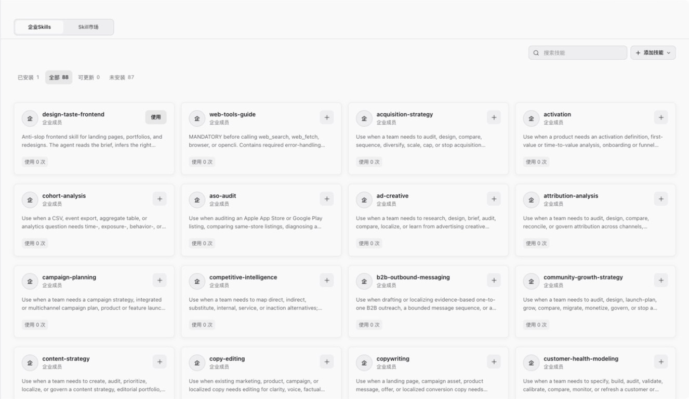

先用顶部搜索框找到 Skill，再用“已安装”“全部”“可更新”“未安装”缩小范围。卡片右上角显示当前可执行的“安装”或“使用”操作。

Skill 按钮：

| 按钮 | 功能 |
| --- | --- |
| 搜索企业 Skill / 搜索 Skill | 按名称或说明筛选 |
| 已安装 / 全部 / 可更新 / 未安装 | 按安装状态筛选 |
| 分类筛选 | 在 Skill 市场按类别筛选 |
| 查看详情 | 查看说明、版本、来源和工具要求 |
| 安装 | 安装到本机；本地运行服务未连接时不可用 |
| 更新 | 更新已安装版本，更新后关键流程应重新测试 |
| 使用 | 打开项目选择器 |
| 使用所选项目 | 在目标项目中创建带该 Skill 的会话 |
| 预览案例 | 查看 Skill 示例产物 |
| 加载更多 Skill | 获取下一批市场条目 |

“通过对话生成”“上传技能”等入口用于制作和维护 Skill，不属于普通使用流程。没有组织授权时不要自行上传；安装外部 Skill 前应确认来源和数据处理范围。

#### 2.4.2 连接器：让 Agent 调用其他系统

连接器提供 MCP 工具，例如查询企业数据、访问知识库或调用外部服务。

**适合什么时候用：** 任务必须读取 Clawee 项目之外的系统数据，或需要把结果写入经过组织授权的外部服务。只处理本机文件时通常不需要连接器。

使用步骤：

1. 点击侧栏“连接器”。
2. 用搜索和状态筛选找到目标连接器。
3. 尚未安装时点击“安装”。
4. 需要认证时点击“登录”，完成目标服务授权。
5. 打开连接器开关。
6. 回到会话，通过“添加上下文” -> “连接器”启用它。

一个企业连接器要正常使用，通常需要同时满足：本地已安装并开启、Gateway 上游正常、当前账号或 Agent 已获得 Tool 授权、调用符合门禁策略。

**完成标志：** 连接器显示已安装、已开启，需要登录的连接器显示已登录；会话中调用后能返回预期数据或结果。若提示无权限或调用被拒绝，记录连接器名称、操作时间和错误提示，请管理员检查授权与审批状态。

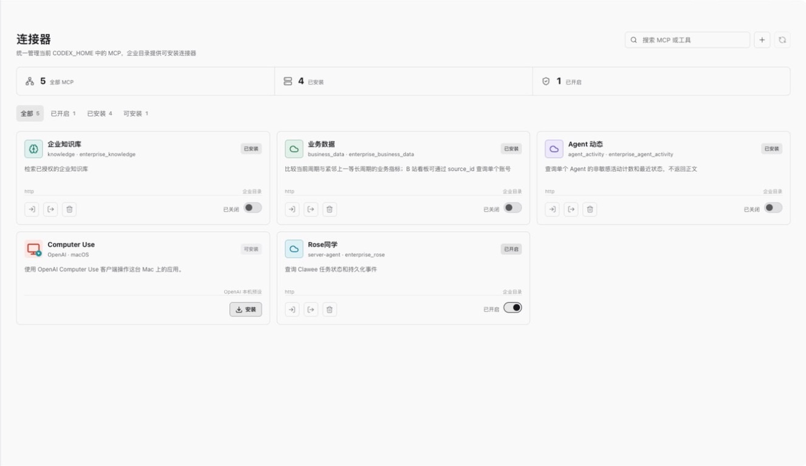

页面顶部显示连接器总数、已安装数和已开启数；每张卡片底部提供登录、退出、删除和启用开关。普通用户通常只需要安装、登录并开启管理员指定的连接器。

连接器按钮：

| 按钮 | 功能与注意事项 |
| --- | --- |
| 搜索连接器 | 按名称筛选 |
| 全部 / 已开启 / 已安装 / 可安装 | 按状态筛选 |
| 安装 | 安装连接器到本机 |
| 登录 | 完成连接器自己的认证 |
| 退出 | 清除该连接器登录状态，依赖任务可能不可用 |
| MCP 开关 | 启用或停用连接器 |
| 刷新连接器 | 重新读取安装和连接状态 |
| 重试 | 重新尝试失败的加载或连接 |
| 删除 | 删除自定义或已安装连接器，先确认没有定时任务依赖 |

“新增 MCP”“新增自定义 MCP”是技术人员使用的接入入口。普通用户需要新连接器时，应向管理员说明目标系统和用途，不要自行填写命令、地址或凭据。

#### 2.4.3 企业知识库：查询组织资料

企业知识库适合查询制度、产品资料、项目文档和常见问题。它不是普通文件夹：文档上传后还需要底层服务解析和索引，之后 Agent 才能检索。

**适合什么时候用：** 需要依据组织已经维护的制度、产品或项目资料回答问题，并希望多人使用同一份资料来源。

使用步骤：

1. 点击侧栏“企业知识库”。
2. 选择一个有权访问的知识库。
3. 需要补充资料时点击“上传文档”，等待文档状态从“处理中”变为“可用”。
4. 点击“在对话中使用”，选择项目。
5. 在会话中说明问题、时间范围和希望引用的资料。
6. 检查回答是否有资料依据，不确定时要求 Agent 标明来源。

**完成标志：** 上传的文档显示“可用”，会话已带上目标知识库，Agent 能基于其中资料回答并指出来源。若文档长时间停在“处理中”，先刷新列表；显示“处理失败”或仍无法检索时，请管理员检查解析和索引状态。

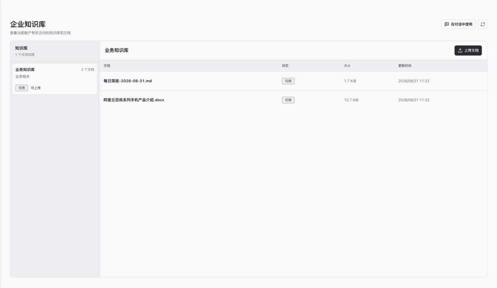

左侧选择知识库，右侧查看文档及“可用”“处理中”等状态。要让 Agent 使用资料，点击右上角“在对话中使用”；要补充资料，先选中知识库，再点击“上传文档”。

本指南示例使用 Markdown 文档；其他可上传格式以当前上传窗口的提示为准。

知识库按钮：

| 按钮 | 功能 |
| --- | --- |
| 选择知识库 | 进入具体知识库和文档列表 |
| 上传文档 | 把文件发送到当前企业知识库 |
| 选择知识库文档 | 缩小本次使用的资料范围 |
| 在对话中使用 | 选择项目并创建使用该知识库的会话 |
| 刷新企业知识库 / 重新加载 | 重新读取授权和文档状态 |
| 返回知识库列表 | 从文档页返回列表 |

看不到知识库时，先确认客户端已登录正确 Gateway，再请管理员检查成员查看权限和知识库调用权限。

#### 2.4.4 共享网盘：获取和共享团队文件

共享网盘中的文件由 Gateway 管理，不会与本机项目自动同步。

**适合什么时候用：** 团队需要共同保存、分发或更新同一份文件。只供自己和 Agent 使用的过程文件，留在本机项目中即可。

从网盘保存文件到项目：

1. 点击“共享网盘”。
2. 选择目标共享空间。
3. 搜索并选中文件。
4. 点击“保存到当前项目”，选择本机保存位置。
5. 本地已有同名文件时，比较内容后再决定是否“覆盖保存”。

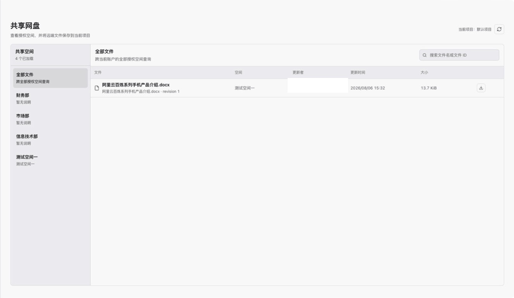

左侧用于切换授权空间，右侧用于搜索和选择文件；文件行最右侧的保存图标会把该文件保存到页面右上角显示的当前项目。截图中的内部更新者标识已隐藏。

上传或替换文件：

1. 先确认当前共享空间和成员范围。
2. 点击“上传文件”或目标文件的“替换文件”。
3. 选择本机文件并核对名称。
4. 提交后刷新列表，确认版本和更新时间。

**完成标志：** 下载时，本机项目中可以打开保存后的文件；上传或替换时，共享网盘显示正确文件名、版本和更新时间。看不到空间或不能上传时，请管理员检查你的空间成员权限。

| 按钮 | 功能与注意事项 |
| --- | --- |
| 选择共享空间 | 切换部门或项目空间 |
| 搜索共享文件 | 按文件名筛选 |
| 上传文件 | 将本机文件发送到 Gateway |
| 替换文件 | 用新文件替换共享版本，会影响其他成员 |
| 保存到当前项目 | 把共享文件下载到本机项目 |
| 覆盖保存 | 覆盖本机同名文件，只在确认内容后使用 |
| 刷新共享网盘 | 重新读取空间和文件状态 |

### 2.5 使用定时任务、动态、数据看板和设置

#### 2.5.1 定时任务：自动执行重复工作

定时任务适合周期报告、日常提醒和固定检查。计划时间到达时，承担执行的电脑和 Clawee 本地运行服务必须可用。

创建并验证一个定时任务：

1. 点击侧栏“定时任务” -> “创建”。
2. 填写标题和完整任务内容。
3. 设置重复频率、执行日期和时间。
4. 选择项目与运行配置。
5. 点击“创建任务”，检查状态、时区和下一次执行时间。
6. 点击“立即运行”做一次真实测试。
7. 点击“查看上次运行”检查结果；失败时先暂停，再修改配置。

任务内容中应写清输入来源、期望产物、保存位置和失败时的处理方式。

**完成标志：** 任务状态为启用，页面显示正确的“下一次运行”时间，并且“立即运行”测试能生成预期结果。没有运行时先检查电脑是否开机、Clawee 是否可用、任务是否暂停、时间和时区是否正确。

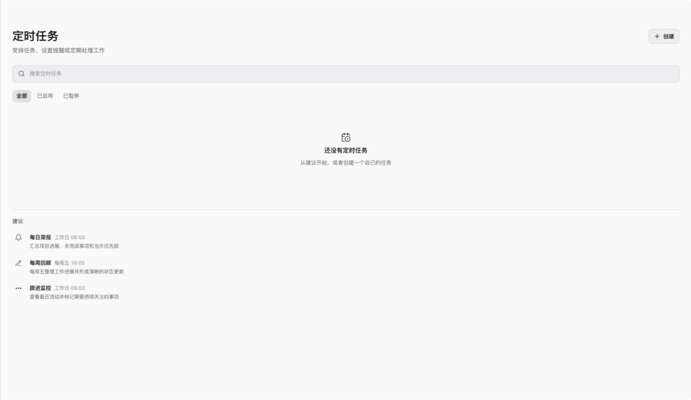

没有现成任务时，可点击右上角“创建”，也可以点击“每日简报”“每周回顾”“跟进监控”等建议快速带入常用配置；创建后再按上面的步骤核对并试运行。

| 按钮/字段 | 功能 |
| --- | --- |
| 搜索定时任务 | 按标题或内容筛选 |
| 状态筛选 | 查看启用、暂停等状态 |
| 打开任务会话 | 查看历次执行过程 |
| 立即运行 | 不等待计划时间，马上真实执行一次 |
| 暂停 | 阻止后续触发，不终止已开始的运行 |
| 启用 | 恢复计划触发 |
| 编辑 / 保存更改 | 修改并保存现有计划 |
| 删除 | 删除计划，历史会话和外部结果不一定同时删除 |
| 取消编辑 | 放弃未保存修改 |
| 每小时分钟 | 按小时重复时，指定每小时第几分钟触发 |

#### 2.5.2 Agent 动态：了解 Agent 是否正常工作

在桌面 App 侧栏点击“Agent动态”。有数据权限的成员可以查看 Agent 在线状态、会话数、轮次、工具调用和最近活动摘要。动态页不展示会话正文。

点击“今天”“近 7 天”或“近 30 天”切换时间范围。切换后，页面时间范围和统计数字应随之更新。发现长期离线、工具错误或活动异常时，打开对应任务，并把 Agent 名称、时间范围和异常提示提供给管理员。

#### 2.5.3 数据看板：查看获权业务指标

在桌面 App 侧栏点击“数据看板”。页面会按组织配置展示业务视图，例如内容运营或投放数据。

使用步骤：

1. 点击侧栏“数据看板”。
2. 查看页面顶部的统计周期，并留意哪些业务模块已连接企业数据、哪些仍是静态示例。
3. 在目标业务卡片上点击“查看详情”。本例选择“哔哩哔哩运营”。
4. 在详情页先核对采集时间，再阅读核心指标和明细排序。
5. 需要返回其他业务模块时，点击左上角返回按钮。

**完成标志：** 进入了正确的业务详情，采集时间、指标卡和明细列表均显示数据。页面显示“数据源尚未接入”“等待业务数据”或只有静态示例时，表示页面和权限已经可用，但管理员尚未配置该数据源或完成首次同步。

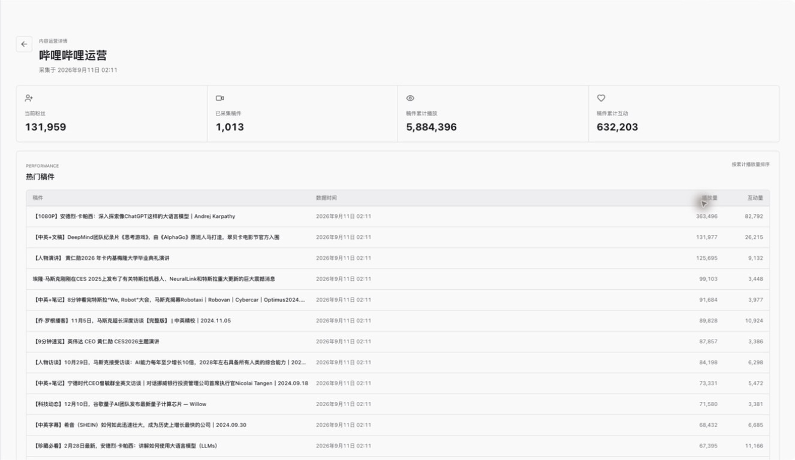

进入“哔哩哔哩运营”后，先核对顶部采集时间，再阅读当前粉丝、已采集稿件、累计播放和累计互动；下方“热门稿件”按累计播放量排序，可用于定位表现较好的内容。

#### 2.5.4 设置：调整自己的使用习惯

设置左侧按“常规”“插件”“记忆”“Profiles”“清理”“诊断”“关于 Clawee”分类。普通用户第一次使用时，优先检查“常规”中的默认权限和关闭窗口行为，并将默认权限设为“请求批准”；出现运行问题时再进入“诊断”。

| 设置分类 | 主要功能 | 使用建议 |
| --- | --- | --- |
| 常规 | 浅色/深色、重点色、默认权限、关闭窗口行为、动态背景 | 默认权限建议使用“请求批准” |
| 插件 | 查看本地运行服务和插件状态 | 连接器或模型异常时先检查 |
| 记忆 | 搜索、新建、编辑、停用或删除记忆 | 不保存密码、Token 和不必要的个人信息 |
| Profiles | 保存模型、推理级别和权限等常用组合 | 熟悉模型选项后再按任务类型建立 |
| 清理 | 按保留天数和范围预览、删除本地数据 | 先“检查可清理内容”和“清理预览”，再确认删除 |
| 诊断 | 检查本地运行服务、模型、连接和版本 | 排障后重新检查 |
| 关于 Clawee | 查看版本、检查更新 | 检查更新不会自动安装未确认版本 |

记忆相关按钮中，“停用”会保留内容但停止使用；“删除记忆”“删除摘要”和“确认删除”会移除相应本地数据。“全部停用”会一次停用当前范围内的记忆。

Profile 中的高级配置由技术人员维护。普通用户只需选择已有 Profile，或保存自己已经验证可用的模型和权限组合。

## 3. Gateway 用户中心：账号与企业资源

> 本章面向账号负责人、设备负责人或在管理员指导下进行接入的用户。只用 Clawee 完成日常任务时，可以跳过本章。
>
> 本章截图均来自浏览器中的 Gateway 用户中心，不是 Clawee 桌面 App，也不是 Gateway 管理后台。

Gateway 用户中心用于查看个人名下的 Agent、设备接入状态和企业工具授权。这里主要是查看和接入，不是日常执行任务的主界面。

进入方式：在浏览器访问组织提供的 Gateway 地址并登录。页面左侧出现“Agent”“MCP”“Collector”“动态”“数据看板”和“技能”时，表示已经进入用户中心；如果当前在管理后台，点击“进入用户中心”返回。

### 3.1 Agent：查看接入和授权

在“Agent”页面可以查看自己的 Agent 是否已接入 MCP、使用哪个账号 Token，以及拥有哪些 Tool 授权。

| 按钮 | 功能与注意事项 |
| --- | --- |
| 查看令牌详情 / 查看 Token | 查看 Token 状态；不要截图或发送 Token 值 |
| 生成 Token | 没有有效 Token 时生成，只写入可信 Agent 配置 |
| 轮换 Token | 换发 Token，旧 Token 立即失效，并可能影响账号下多个 Agent |
| 吊销 Token | 停止账号下 Agent 使用 Gateway MCP |
| 查看授权 | 查看可调用能力和有效期 |
| 编辑名称 | 修改显示名称，不改变 Agent 身份 |
| 删除 | 删除不再使用的 Agent 记录，先确认设备和任务已停用 |

### 3.2 MCP：确认自己能使用哪些企业工具

MCP 能力目录只显示当前账号已授权且可用的上游服务和 Tool。调用前阅读 Tool 的名称和说明，不要猜测参数。

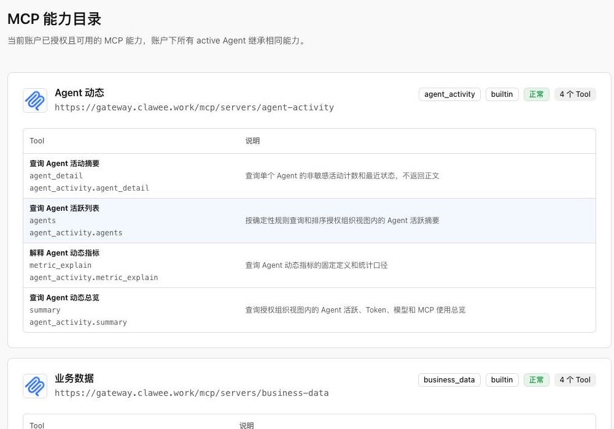

如果客户端能看到连接器但调用被拒绝，记录调用时间和 Tool 名称，请管理员从授权、门禁和代理审计中排查。

### 3.3 Collector：把受管设备接入 Gateway

Collector 负责汇报设备、版本、心跳和在线状态。通常由设备管理员安装。

1. 在 Collector 页面取得组织允许的安装方式。
2. 在目标设备按 Shell、PowerShell 或安装 URL 的说明完成安装。
3. 回到页面点击“查看”，确认版本、最近心跳和在线状态。
4. 设备停用或凭据泄露时点击“撤销 Token”，然后重新注册。

| 按钮 | 功能与注意事项 |
| --- | --- |
| 重新生成 | 生成新的注册码或安装信息，旧信息可能失效 |
| 复制 | 复制安装信息；内容可能包含接入凭据 |
| 查看 | 打开 Collector 详情 |
| 撤销 Token | 使现有凭据失效，设备会停止上报 |
| 删除 | 删除不再使用的 Collector 记录 |

注册码和一键安装命令只能交给目标设备的受信管理员，不要放入公开工单、会话、截图或文档。

### 3.4 动态：查看获权 Agent 活动

1. 在 Gateway 用户中心左侧点击“动态”。
2. 点击“今天”“近 7 天”或“近 30 天”切换统计范围。
3. 查看 Agent 在线状态、会话数、轮次、工具调用和最近活动。
4. 需要进一步定位时，记录 Agent 名称、时间范围和异常指标，再交给管理员排查。

**完成标志：** 页面显示所选时间范围内的 Agent 列表和活动统计。页面无数据时，先确认时间范围，再请管理员检查活动查看权限和采集状态。

### 3.5 数据看板：查看已授权业务数据

1. 在 Gateway 用户中心左侧点击“数据看板”。
2. 选择“今天”“近 7 天”或“近 30 天”。
3. 点击“小红书运营”“抖音投放”或“哔哩哔哩运营”等业务标签。
4. 对支持多账号的看板，在“查看账号”中选择目标账号。
5. 查看数据状态、核心指标、趋势和明细表，注意页面标明的统计口径和采集时间。

下面是 Gateway 用户中心“哔哩哔哩运营”视图的近 7 天数据示例：

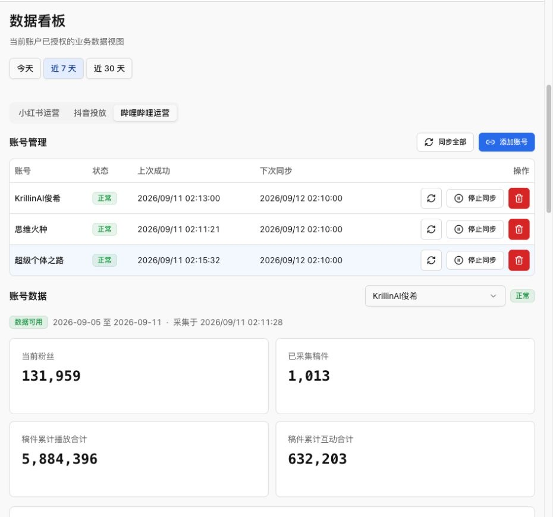

**完成标志：** 页面显示“数据可用”，时间范围、业务标签和账号均正确，指标卡与趋势图有实际数据。显示“等待业务数据”时，需要管理员完成数据源配置或首次同步。

数据看板按钮：

| 按钮或选项 | 功能与注意事项 |
| --- | --- |
| 今天 / 近 7 天 / 近 30 天 | 切换统计时间范围 |
| 业务标签 | 切换小红书、抖音、哔哩哔哩等数据视图 |
| 查看账号 | 在多账号看板中切换当前查看对象 |
| 同步全部 | 立即同步当前业务视图中的全部账号，等待完成后检查采集时间 |
| 添加账号 | 接入新的业务账号；只由获得组织授权的负责人操作 |
| 立即同步 | 只同步对应账号 |
| 停止同步 | 停止该账号后续自动同步，不会删除已采集数据 |
| 删除账号 | 删除数据源账号配置；执行前确认不再需要同步 |
| 播放量 / 粉丝数 / 互动数 | 切换日增长趋势图展示的指标 |

### 3.6 技能中心：查看 Gateway 中的企业 Skill

1. 在 Gateway 用户中心左侧点击“技能”。
2. 使用空间筛选查找团队发布的 Skill。
3. 点击“查看”阅读版本、说明和所属空间。
4. 有上传权限且负责维护 Skill 时，才使用“上传 Skill”。普通成员在桌面 App 的“企业Skill中心”安装和使用 Skill。

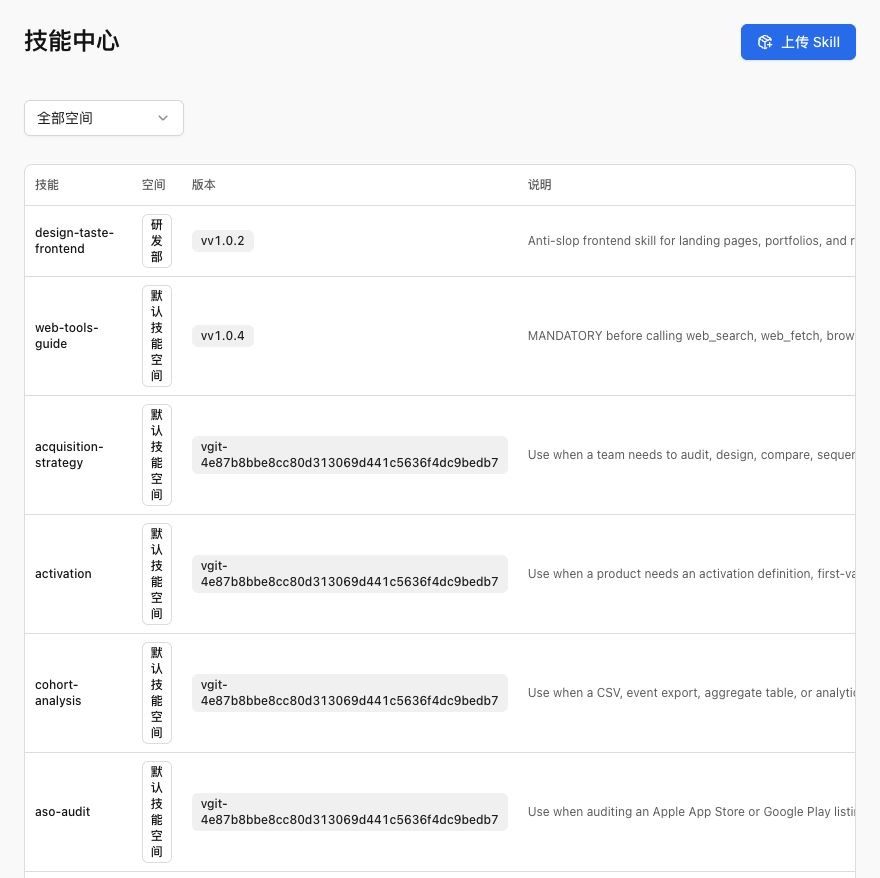

**完成标志：** 能看到当前账号获权空间中的 Skill，并可打开详情。桌面 App 找不到同一 Skill 时，请管理员检查发布状态和技能空间授权。

页面顶部还提供浅色、深色和跟随系统主题。“进入管理后台”只对管理员显示。

## 4. Gateway 管理后台：企业治理

> 本章面向负责账号、企业资源、Agent 接入和 MCP 治理的管理员。普通用户不需要执行本章操作。
>
> 本章截图均来自 Gateway 管理后台。页面顶部或侧栏出现“管理后台”标识时，才按本章操作。

进入方式：在浏览器登录 Gateway，使用具有管理权限的账号点击“进入管理后台”。左侧出现“智能体活动”“企业组件”“MCP 网关”和“系统管理”等导航时，表示已经进入管理后台；普通成员看不到该入口是正常的。

### 4.1 管理员每天先看总览

总览集中显示 Agent 接入覆盖、治理待办、Gateway 健康、代理调用和企业资源状态。

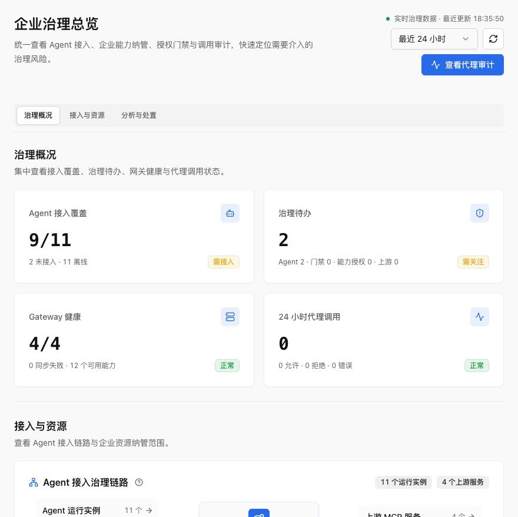

建议按以下顺序巡检：

1. 切换“统计时间范围”，点击“刷新数据”。
2. 检查 Agent 接入覆盖和新增未接入实例。
3. 检查上游服务、能力同步和缺失授权。
4. 检查门禁待办、拒绝、错误和平均延迟。
5. 通过“查看代理审计”或各卡片的“查看/接入”进入具体页面处理。

“治理概况”“接入与资源”“分析与处置”用于跳转到总览分区；“请求量/平均延迟”和“按使用人/按 Agent”用于切换统计口径。

### 4.2 接入和管理智能体

标准接入流程：

1. 在“采集器管理”确认 Collector 已发现运行实例。
2. 在“智能体管理”点击“创建智能体”，创建 MCP 治理身份并选择责任账号。
3. 对运行实例点击“接入 MCP”，选择治理身份后“确认绑定”。
4. 点击“查看授权” -> “添加授权”，只选择完成职责所需的能力。
5. 回到客户端做最小测试，并在代理审计检查结果。

智能体管理按钮：

| 按钮 | 功能与风险 |
| --- | --- |
| 搜索智能体 / 状态筛选 | 定位名称、运行实例或异常状态 |
| 查看 Token、轮换、吊销 | 管理账号级凭据；轮换会使旧 Token 失效 |
| 查看授权 / 添加授权 / 删除授权 | 管理 Tool 访问范围；遵循最小权限 |
| 接入 MCP / 解除关联 | 绑定或分离运行实例与治理身份 |
| 迁移 / 确认迁移 | 更换责任账号，必须填写原因并检查授权影响 |
| 编辑名称 | 只修改显示名称 |
| 删除智能体 | 删除治理记录，先处理凭据、授权和依赖任务 |

采集器管理中的“生成注册码”和“复制”会产生或复制敏感接入信息；“撤销 Token”会使设备停止上报。

### 4.3 管理企业知识库

知识库上线流程：创建知识库 -> 管理文档 -> 等待解析和索引 -> 配置成员授权 -> 用目标账号验证检索。

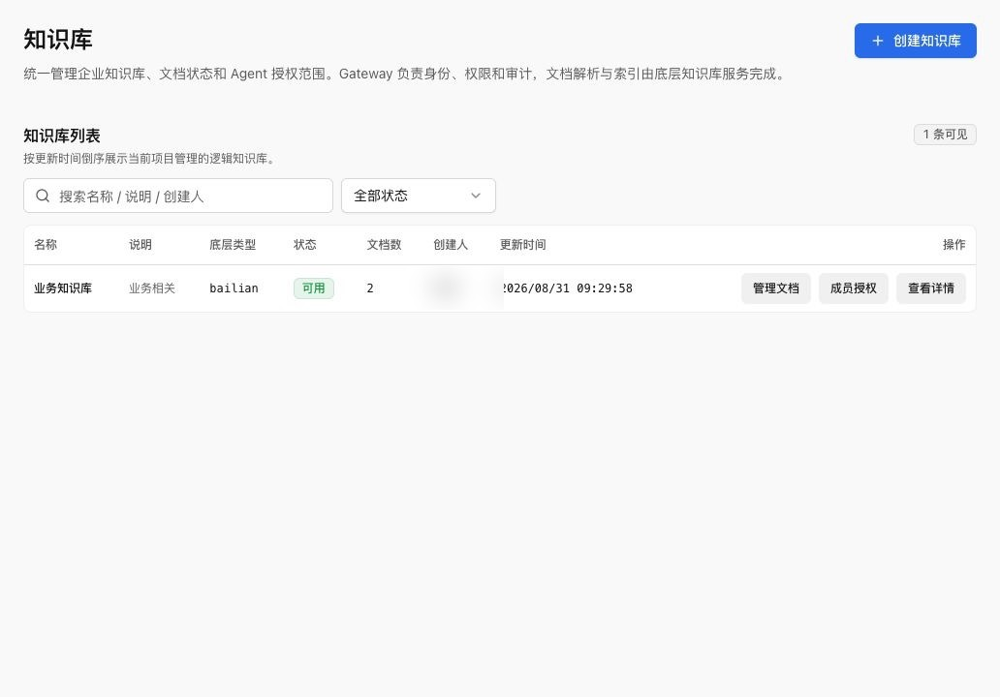

| 按钮 | 功能与风险 |
| --- | --- |
| 创建知识库 | 填写名称和说明，创建逻辑知识库 |
| 搜索 / 全部状态 | 定位知识库或解析异常 |
| 管理文档 | 上传、同步或删除文档 |
| 成员授权 | 分配查看、上传和 MCP 调用权限 |
| 添加成员 / 编辑 / 删除授权 | 调整成员权限，保存后立即影响访问范围 |
| 查看详情 / 编辑 | 查看或修改基础信息，不改变底层绑定 |
| 删除知识库 | 删除后知识库和文档不再可用；先撤销有效授权 |

### 4.4 管理企业 Skill

Skill 上线流程：上传版本或同步受信 GitHub 来源 -> 查看详情和包摘要 -> 发布到技能空间 -> 配置空间成员 -> 在客户端测试。

| 按钮 | 功能与风险 |
| --- | --- |
| Skill 列表 / 技能空间 / GitHub 来源 | 切换管理对象 |
| 上传版本 / 确认上传 | 上传 ZIP 包和版本信息；上传不等于发布 |
| 状态 / 空间筛选 | 定位未发布版本或目标团队 Skill |
| 批量调整技能空间 | 调整后立即按目标空间权限控制访问 |
| 批量发布 | 将最新上传版本设为当前版本 |
| 查看详情 | 审查版本、来源、说明和发布状态 |
| 新增来源 / 编辑来源 | 配置受信 GitHub 仓库、分支、扫描根和调度 |
| 同步 | 立即扫描来源，检查发现数后再发布 |
| 停用 / 启用来源 | 暂停或恢复自动同步，不删除已同步版本 |

### 4.5 管理共享网盘

先创建共享空间，再配置成员授权，最后上传文件。不要先上传敏感文件再补权限。

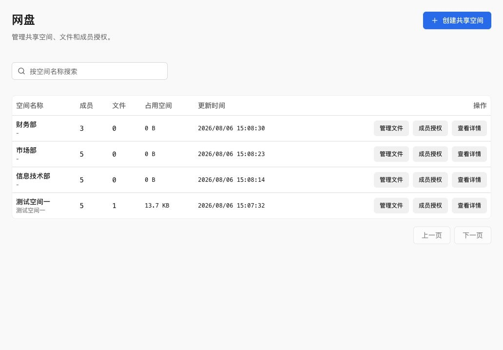

| 按钮 | 功能与风险 |
| --- | --- |
| 创建共享空间 | 创建部门或项目空间 |
| 管理文件 | 搜索、上传、下载或上传新版本 |
| 成员授权 | 配置空间成员和 Action |
| 查看详情 / 编辑 | 查看或修改空间名称和说明 |
| 上传新版本 | 替换共享文件内容，会影响其他成员 |

### 4.6 接入 MCP 上游服务

上游服务上线顺序：新增配置 -> 同步 Tool -> 在能力目录审核 -> 设置门禁 -> 启用 -> 授权 -> 测试和审计。

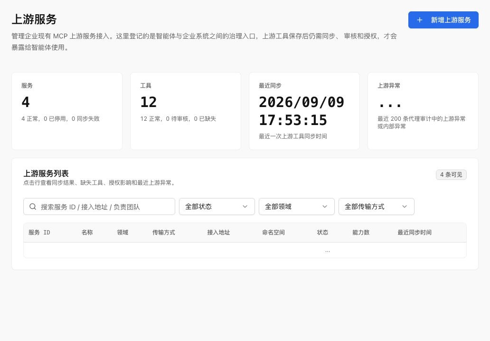

| 按钮 | 功能与风险 |
| --- | --- |
| 新增上游服务 | 配置传输方式、地址和责任团队，只登记接入点 |
| 状态 / 领域 / 传输方式筛选 | 定位同步失败或指定类型服务 |
| 查看详情 | 查看同步结果、缺失 Tool、授权影响和异常 |
| 编辑 / 导入 stdio 配置 / 保存 | 修改接入配置，保存后仍需同步 |
| 同步工具 | 从上游读取 Tool 并更新能力目录 |
| 禁用 / 启用 | 停止或恢复新调用；变更前检查依赖 |
| 查看能力目录 / 查看代理审计 | 带当前上游筛选进入对应页面 |
| 删除 | 仅删除非内置上游；必须先禁用并处理授权 |

### 4.7 审核 MCP 能力

能力由上游同步产生。管理员需要确认结构定义、暴露名称、风险等级、只读/破坏性标记和门禁策略。

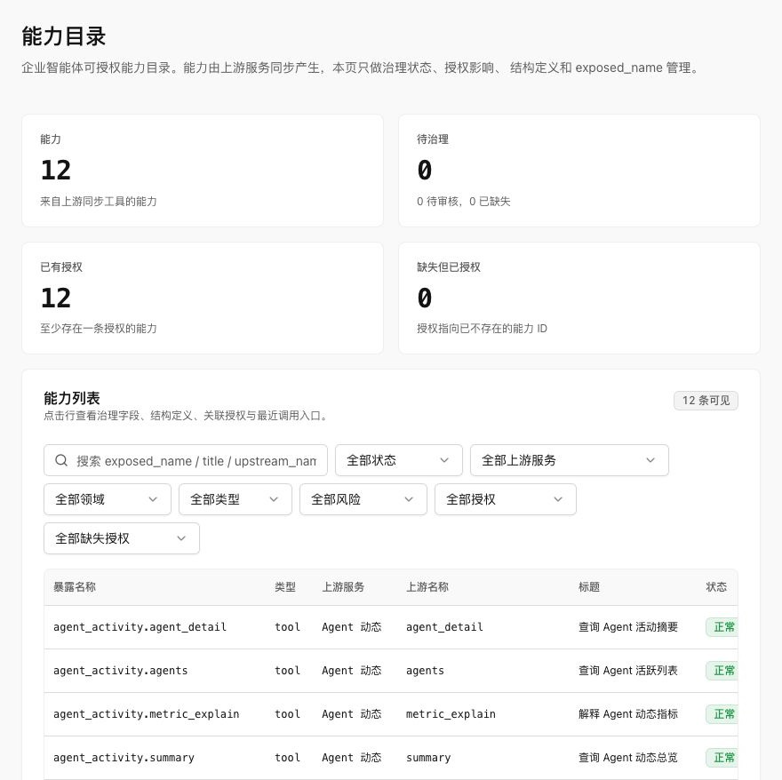

| 按钮 | 功能与风险 |
| --- | --- |
| 多项筛选 | 按状态、上游、领域、类型、风险、授权和缺失授权定位能力 |
| 详情 | 查看结构、风险、门禁和授权信息 |
| 启用 / 禁用 | 控制能力能否调用，不自动增删 Agent 授权 |
| 编辑 / 保存 rename | 修改暴露名称；active 能力改名会改变调用入口 |
| 门禁策略 / 确认保存 | 配置用户确认或管理员审批 |
| 查看审计 | 检查该 Tool 的真实调用 |
| 删除 | 仅对已缺失能力显示，会一并删除关联授权 |

### 4.8 处理门禁和审计

门禁队列用于处理需要确认或审批的真实调用。

处理步骤：

1. 使用类型、状态和风险筛选找到待办。
2. 点击“详情”，检查 Tool、动作、操作者、智能体、冻结参数摘要和有效期。
3. 确认调用符合业务要求后点击“通过”；否则点击“拒绝”并填写原因。
4. 执行完成后点击“查看执行审计”。

“通过”会让 Gateway 使用冻结参数继续真实执行，不能只看任务标题决定。已过期或已终结门禁会显示“不可操作”。

代理审计支持按裁决结果、智能体、上游、Tool 和时间筛选。“仅看错误”适合故障排查；点击“详情”查看调用身份、裁决、耗时、追踪和错误。审计信息外发前必须脱敏。

### 4.9 管理账号、角色和数据权限

推荐顺序：创建角色并选择权限 -> 创建账号并分配角色 -> 按资源补充数据权限 -> 用目标账号重新登录验证。

账号管理按钮：

| 按钮 | 功能与风险 |
| --- | --- |
| 新增账号 | 填写邮箱、名称、初始密码和状态 |
| 角色 / 保存角色 | 分配后台角色，遵循最小权限 |
| 修改昵称 | 只修改显示名称 |
| 重置密码 | 保存后该账号现有会话失效 |
| 禁用 / 启用 | 停止或恢复账号使用，操作前检查 Agent 和任务归属 |
| 合并 / 确认合并 | 将停用账号归并到启用账号，必须填写原因 |

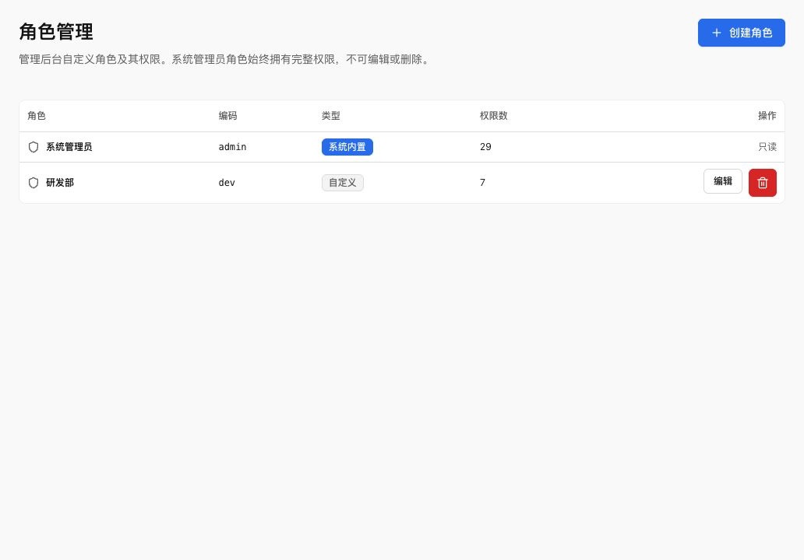

角色管理中的“创建角色”需要填写角色编码、名称和权限树；编码创建后不可修改。“选择某类全部权限”会批量勾选，应展开权限明细后再保存。系统角色通常只读，自定义角色可编辑或删除。

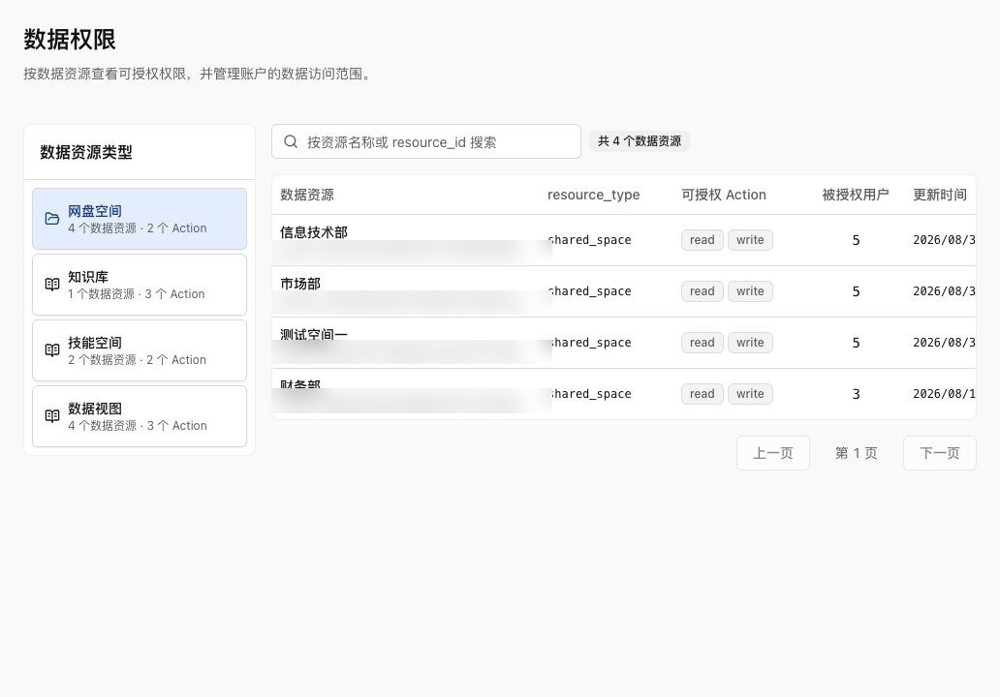

数据权限页按网盘空间、知识库、技能空间和数据视图分类。点击“管理授权”后，可添加成员、编辑或删除资源级 Action。权限变更后应以目标账号验证实际菜单、数据范围和 Agent 调用。

### 4.10 配置平台外观

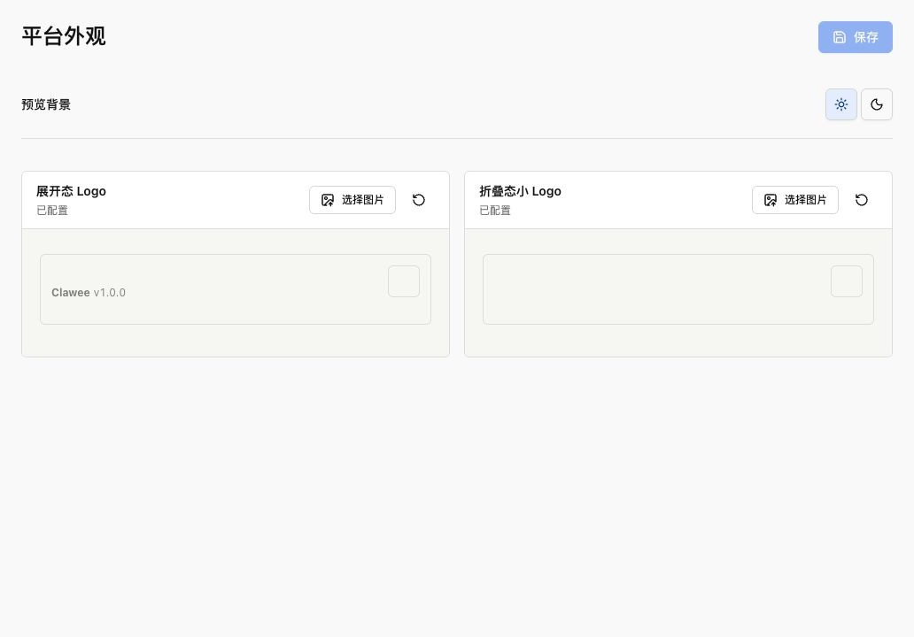

1. 用“浅色背景”和“深色背景”检查 Logo 效果。
2. 分别为展开态 Logo 和折叠态小 Logo 点击“选择图片”。
3. 不满意时点击恢复默认图标。
4. 确认预览后点击“保存”。

## 5. 常见问题

### 5.1 Clawee 桌面 App

#### 客户端显示模型不可用

先重启 Clawee，再进入“设置” -> “诊断”执行检查。若仍没有可选模型，把页面中的错误提示和发生时间发给管理员；普通用户不要自行填写不清楚的服务地址或密钥。

#### 看不到企业 Skill、知识库、动态或数据看板

这些入口受发布状态和权限控制。确认客户端已登录正确 Gateway，再请管理员检查技能空间、知识库成员授权和数据权限。

#### 连接器可见但调用被拒绝

先确认连接器已安装、已开启且已登录，再回到原会话检查是否有待审批卡片。仍被拒绝时，记录连接器名称、操作时间和错误提示，请管理员检查工具授权、审批策略和调用审计。

#### 定时任务没有运行

确认任务未暂停、下一次运行时间和时区正确、项目仍然存在，并在计划时间保持电脑和 Clawee 可用。连续失败时先查看任务会话中的错误，不要反复无条件重试。

#### 文件保存时提示已被外部修改

说明磁盘文件在你编辑期间发生了变化。先点击“重新加载”比较新内容；只有确认要用当前编辑替换磁盘版本时，才使用“覆盖保存”。

#### 按钮是灰色，无法点击

常见原因包括尚未选择项目、附件仍在上传、任务正在处理、本地运行服务未连接、账号未登录或缺少权限。先阅读按钮附近提示，再检查“设置” -> “诊断”。

### 5.2 Gateway 用户中心

#### 设备接入状态一直离线

此问题由设备负责人处理：确认目标设备上的采集服务正在运行、设备能够访问 Gateway、接入凭据未被撤销，并检查版本和最近心跳。普通用户只需把设备名称和离线时间提供给负责人。

#### 数据看板只有空指标

先确认选择了正确的时间范围、业务标签和账号。出现“数据源尚未接入”或“等待业务数据”时，需要管理员配置对应数据源并完成首次同步，刷新用户中心不能解决。

### 5.3 Gateway 管理后台

#### 用户已经授权，仍然看不到资源

先确认授权的是正确账号和正确资源，再检查资源是否启用或发布、授权 Action 是否包含实际操作、是否存在有效期限制。保存后用目标账号重新登录用户中心或桌面 App 验证，不要只看管理后台中的授权记录。

## 6. 安全使用要点

- 默认使用“请求批准”，只在任务范围清晰且来源可信时使用“完全访问权限”。
- 不在会话、截图、工单或文档中暴露模型 API Key、MCP Token、Collector 注册码和安装命令。
- 安装第三方 Skill 或连接器前，检查来源、脚本、依赖、网络访问和数据处理范围。
- 上传客户资料前确认组织的数据分级和授权要求；模型执行时，必要内容会发送给所配置的模型服务。
- 对“永久删除”“覆盖保存”“立即运行”“通过门禁”“轮换/吊销 Token”等操作，确认对象和影响范围后再执行。
- 本地任务、Gateway 审计和外部模型服务是不同的数据边界，删除其中一处不会自动删除另外两处。
- 发现凭据泄露或异常调用时，先轮换或吊销相关 Token，再通过代理审计确认影响范围。
